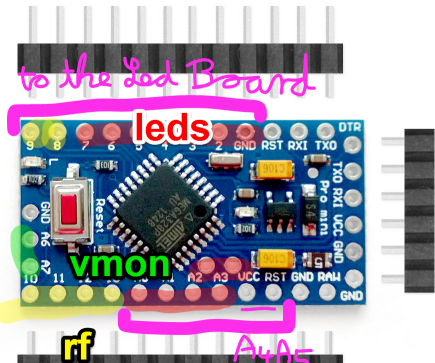

# Firefly simulator 3000
IOT version.

Communicates through a nRF24 module with my raspberry pi server.
The server is running the [nRF24_MQTT bridge](https://github.com/yetifrisstlama/nRF24_MQTT).

## Building
Install platformio, then:

```bash
$ pio run -t upload -t monitor
```

You can turn on UART prints in the platformio.ini file to see what's going on.

```ini

build_flags =
	; Debug prints on UART: 0 = None (fastest!) 1 = Some, 2 = A lot
	-DDEBUG_LEVEL=2
```

## Hardware
a little more info on the hardware can be found in this old [blog post](http://yetifrisstlama.blogspot.com/2014/07/fireflys-in-jar.html).

### Ingredients

  * A large jam jar (Ikea)
  * Mini USB Nano V3.0 ATmega328 5V Microcontroller Board (eBay)
  * FTDI serial cable for flashing (eBay)
  * Solar cell, 5.5 V, 50 mA or larger (eBay)
  * Lipo - battery cell, 100 mAh - 600 mAh (eBay / old laptop / old cellphone, etc.)
  * 12 x tiny LEDs, different colors, the smaller the better, with ~80 - 200 Ohm series resistors, depending on how bright you want it (kit from eBay)
  * Very thin magnet wire from the coil of a miniature relais
  * SMD resistors with 1 % tolerance: 2 x 560 kOhm,  2 x 160 kOhm. For two voltage dividers to sample the solar cell and battery voltage
  * SMD ceramic capacitors, 2 x 100 nF, to stabilize the analog inputs of the AVR
  * Some circuit board, glue, prototyping wires, sticky tape


### Arduino pro mini modifications
The AVR board has been modified in the following way for very low power operation:

  * The voltage regulator has been removed and VCC has been connected directly to the battery
  * The Schottky diode, which is already on the board, has been rewired to be in series with the solar cell. It only has 0.2 V forward voltage drop, which is excellent!
  * 2 Voltage dividers with the 560k and 160k resistors and 100nF capacitors have been made and connected to Vsolar and Vbattery. The AVR uses the internal 1.1 V reference voltage for the ADC, which allows to measure voltages up to 4.95 V

### Optional: use internal 8 MHz RC osc.
The fuses have been reprogrammed to use the 8 MHz internal oscillator instead of the 16 MHz onboard crystal. This significantly speeds up the processor wake up time from sleep and hence saves power.

__Check current fuse settings:__

```bash
cd ~/.platformio/packages/tool-avrdude
./avrdude -C avrdude.conf -p m328p -c buspirate -P /dev/ttyUSB0
```

[AVR Fuse Calculator](https://eleccelerator.com/fusecalc/fusecalc.php?chip=atmega328p)

__Switch to 8 MHz internal oscillator__

  * no startup delay
  * with 1.8 V brown out reset
  * flash the bootloader for 8 MHz (only needed if previously running at 16 MHz)

```bash
# to use bus-pirate, uncomment the upload_flags and upload_command
# overrides in platformio.ini
pio run -t bootloader
```

### Pinout
Note that this pinout allows to connect an optional nRF24 module to PORTB.



```
Silkscreen, Firmw. Ch.    AVR               (*) = on LED board
2,          6             PD2   LED   y      *  + GND pin
3,          7             PD3   LED   o      *
4,          8             PD4   LED   r      *
5,          9             PD5   LED   w      *
6,          10            PD6.  Led   g      *
7,          11            PD7.  Led   b      *
8                         PB0   Rf ce        *   (No LED)
9                         PB1   Rf irq       *   (No LED)
--------------------------------------------
10                        PB2   Rf csn
11                        PB3.  Rf Mosi
12                        PB4.  Rf Miso
13                        PB5.  Rf Sck
A0,         0             PC0   LED   w      *
A1,         1             PC1   LED   r      *
A2,         2             PC2   LED   y      *
A3,         3             PC3   LED   g      *
A4,         4             PC4   led   w      *
A5,         5             PC5   led   b      *
A6                        ADC6  Vbatt
A7                        ADC7  Vsolar
```
